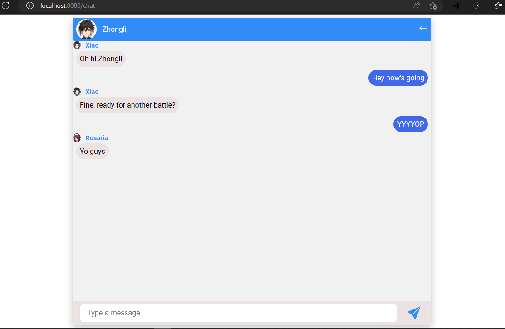

# chat-app-frontend

## Project setup

```
npm install
```

### Compiles and hot-reloads for development

```
npm run serve
```

### Compiles and minifies for production

```
npm run build
```

### Customize configuration

See [Configuration Reference](https://cli.vuejs.org/config/).

### General info

- run backend sever with 'node index.js'

### Note

- app is still incomplete, it lacks many more features that i haven't handled yet
- for further info, check README.md in "chat-app-backend" repository

## Overview

#### <div align="center">Users List</div>

<div align="center"></div>

#### <div align="center">Zhongli's chat</div>

<div align="center"></div>

#### <div align="center">Rosaria's chat</div>

<div align="center"></div>

#### <div align="center">Xiao's chat</div>

<div align="center"></div>
